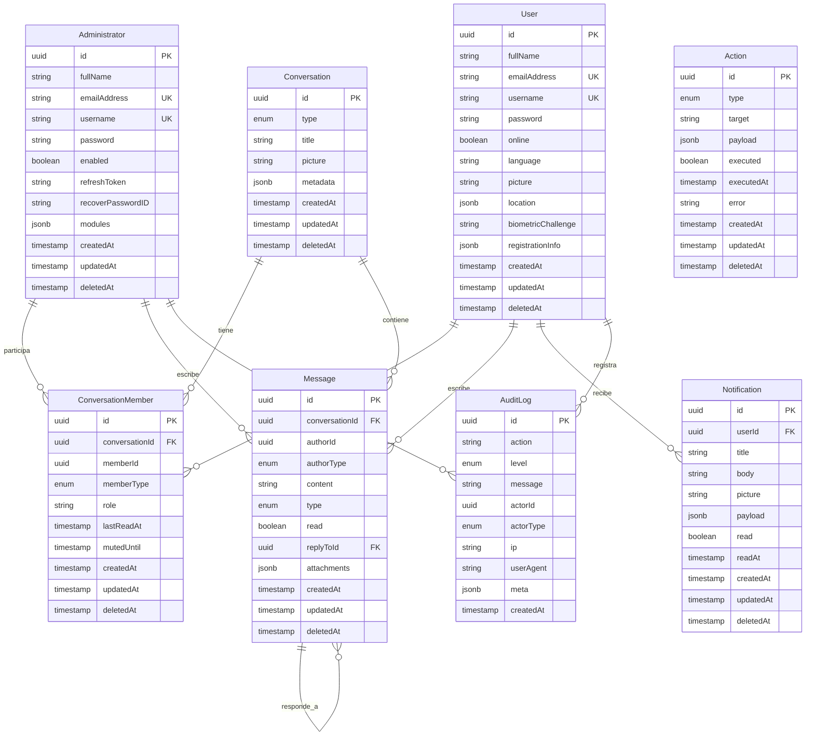
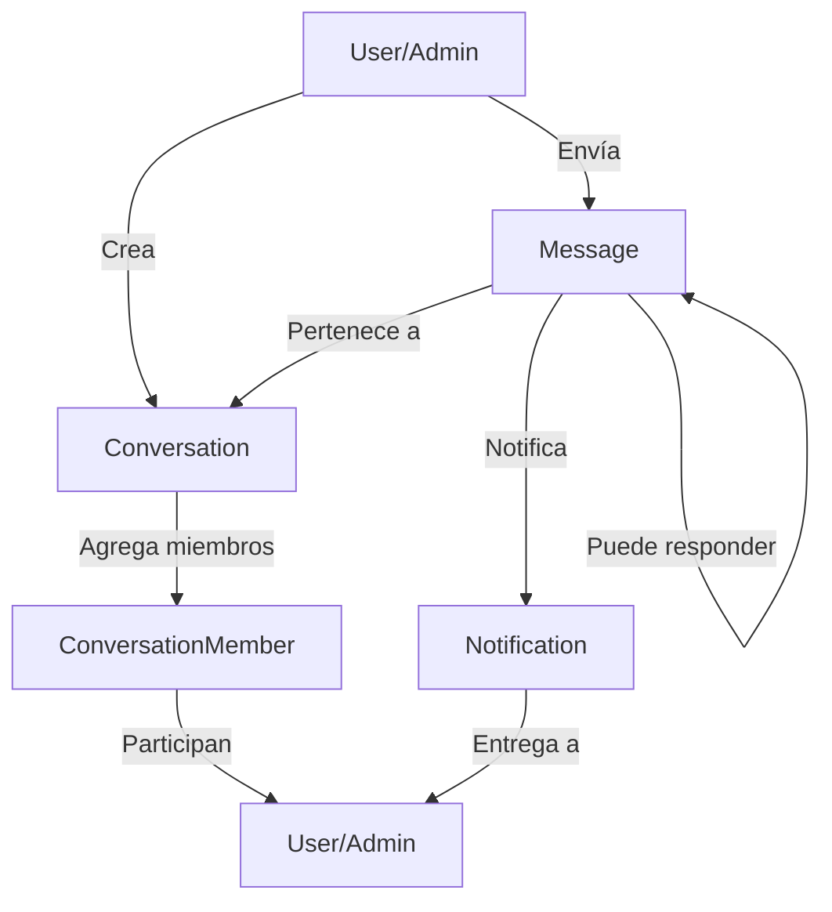
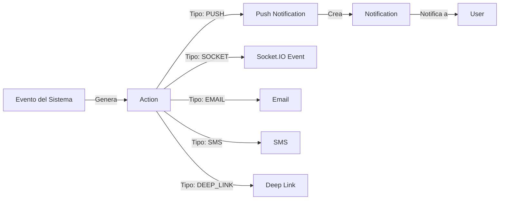
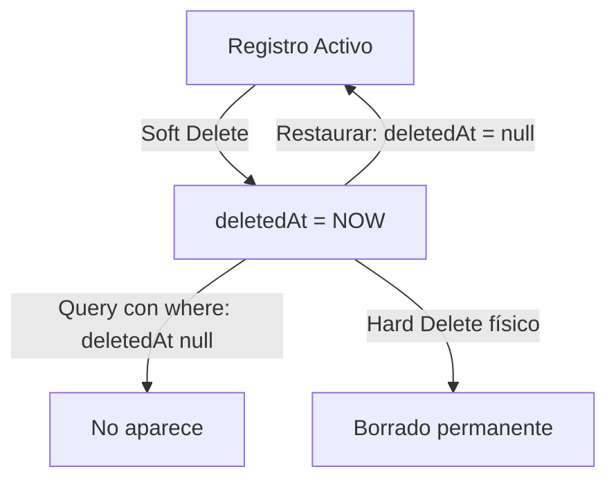

# 🗺️ Diagrama del Schema de Base de Datos

## Diagrama ER (Entity Relationship)



## Relaciones Polimórficas

### 🔀 ConversationMember (Polimórfico)

```
ConversationMember
├── memberId + memberType
│   ├── USER → User.id
│   └── ADMIN → Administrator.id
```

### 🔀 Message (Polimórfico)

```
Message
├── authorId + authorType
│   ├── USER → User.id
│   └── ADMIN → Administrator.id
```

### 🔀 AuditLog (Polimórfico)

```
AuditLog
├── actorId + actorType
│   ├── USER → User.id
│   ├── ADMIN → Administrator.id
│   └── SYSTEM → null (sistema automático)
```

## Flujo de Datos: Chat System



## Flujo de Datos: Notificaciones y Acciones



## Estructura de Soft Delete



## Índices por Tabla

### 🔍 Administrator
- `emailAddress` (unique)
- `username` (unique)
- `deletedAt`

### 🔍 User
- `emailAddress` (unique)
- `username` (unique)
- `online`
- `deletedAt`

### 🔍 Conversation
- `type`
- `deletedAt`

### 🔍 ConversationMember
- `conversationId`
- `(memberId, memberType)` (composite)
- `(conversationId, memberId, memberType)` (unique)
- `deletedAt`

### 🔍 Message
- `conversationId`
- `(authorId, authorType)` (composite)
- `read`
- `createdAt`
- `deletedAt`

### 🔍 AuditLog
- `action`
- `level`
- `(actorId, actorType)` (composite)
- `createdAt`

### 🔍 Action
- `type`
- `target`
- `executed`
- `createdAt`
- `deletedAt`

### 🔍 Notification
- `userId`
- `read`
- `createdAt`
- `deletedAt`

## Enumeraciones

### ConversationType
```typescript
enum ConversationType {
  INDIVIDUAL  // Chat 1-a-1
  GROUP       // Chat grupal
  AI          // Chat con IA
}
```

### MemberType
```typescript
enum MemberType {
  USER   // Usuario final
  ADMIN  // Administrador
}
```

### MessageType
```typescript
enum MessageType {
  TEXT  // Mensaje de texto
  FILE  // Archivo adjunto
  INFO  // Mensaje del sistema
}
```

### LogLevel
```typescript
enum LogLevel {
  DEBUG
  INFO
  WARN
  ERROR
  CRITICAL
}
```

### ActorType
```typescript
enum ActorType {
  USER    // Usuario final
  ADMIN   // Administrador
  SYSTEM  // Sistema automático
}
```

### ActionType
```typescript
enum ActionType {
  PUSH       // Push notification
  SOCKET     // Socket.IO event
  DEEP_LINK  // Deep link / redirect
  EMAIL      // Email notification
  SMS        // SMS notification
}
```

## Tamaño Estimado de Tablas

| Tabla | Crecimiento | Índices | Observaciones |
|-------|-------------|---------|---------------|
| `administrators` | Bajo | 3 | Pocos registros, estable |
| `users` | Alto | 4 | Crecimiento continuo |
| `conversations` | Medio | 2 | Crece con usuarios activos |
| `conversation_members` | Alto | 4 | Múltiples miembros por conversación |
| `messages` | Muy Alto | 5 | **Tabla más grande**, considerar particionamiento |
| `audit_logs` | Alto | 4 | Registro continuo, considerar archivado |
| `actions` | Medio | 5 | Limpieza periódica de ejecutadas |
| `notifications` | Alto | 4 | Limpieza periódica de leídas |

## Recomendaciones de Optimización

### 📈 Particionamiento (PostgreSQL 17+)

Para tablas de alto crecimiento (`messages`, `audit_logs`):

```sql
-- Particionar messages por fecha
CREATE TABLE messages (
  ...
) PARTITION BY RANGE (created_at);

CREATE TABLE messages_2025_01 PARTITION OF messages
  FOR VALUES FROM ('2025-01-01') TO ('2025-02-01');
```

### 🧹 Limpieza Periódica

```sql
-- Eliminar notificaciones leídas > 30 días
DELETE FROM notifications
WHERE read = true
  AND read_at < NOW() - INTERVAL '30 days';

-- Archivar audit logs > 1 año
-- (mover a tabla de archivo o sistema externo)
```

### 📊 Monitoreo de Índices

```sql
-- Ver índices no utilizados
SELECT schemaname, tablename, indexname
FROM pg_stat_user_indexes
WHERE idx_scan = 0
  AND indexrelname NOT LIKE 'pg_toast%';

-- Ver índices más usados
SELECT schemaname, tablename, indexname, idx_scan
FROM pg_stat_user_indexes
ORDER BY idx_scan DESC
LIMIT 20;
```

## 🔐 Seguridad

### Passwords
```typescript
// SIEMPRE hashear con bcrypt
const hashedPassword = await bcrypt.hash(password, 10);
```

### Soft Delete
```typescript
// Excluir eliminados en queries
const activeUsers = await prisma.user.findMany({
  where: { deletedAt: null }
});
```

### Audit Log
```typescript
// Registrar todas las acciones críticas
await prisma.auditLog.create({
  data: {
    action: 'user.delete',
    level: 'WARN',
    message: `User ${userId} deleted by admin`,
    actorId: adminId,
    actorType: 'ADMIN',
    ip: req.ip,
    meta: { deletedUserId: userId }
  }
});
```
